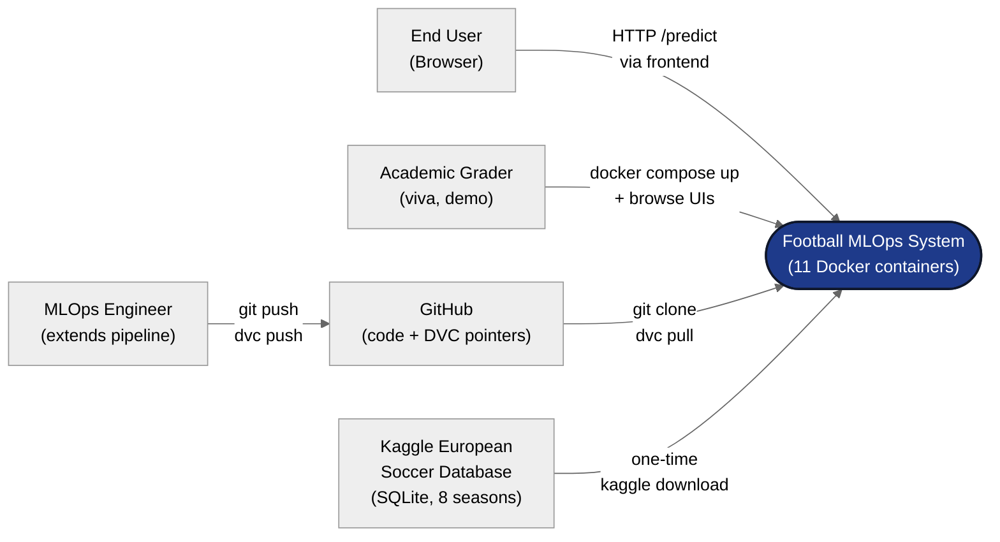
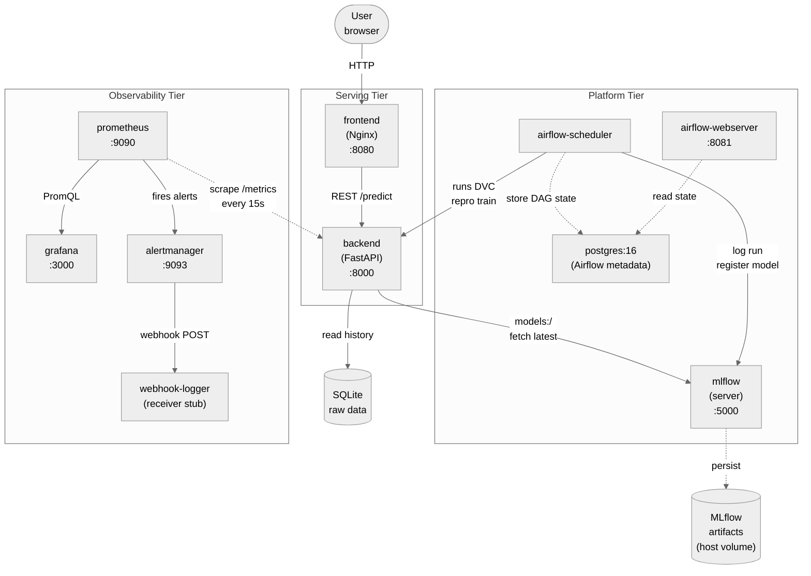
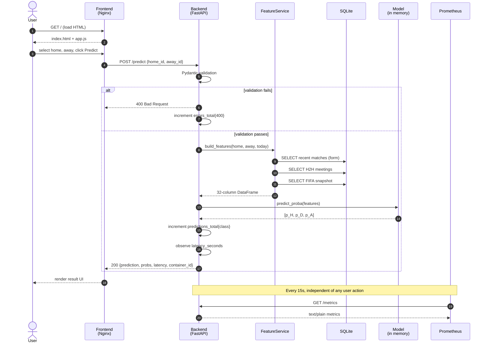

# High-Level Design — Football MLOps End-to-End Project

**Document version:** 1.0
**Last updated:** 2026-04-28 (Day 6)
**Project:** DA5402 Final Project — Football Match Outcome Prediction
**Author:** Muhammed Fiyas
**Related documents:** [LLD](../lld/LLD.md) · [Test Plan](../test_plan/TEST_PLAN.md) · [User Manual](../user_manual/USER_MANUAL.md)

---

## 1. Purpose & Scope

### 1.1 What this system does

The Football Match Outcome Prediction system serves **H/D/A predictions** (Home Win / Draw / Away Win) for European football matches. A user picks two teams from a web UI, the system computes 32 engineered features for that match-up using the team's historical record, and a LightGBM classifier returns the predicted outcome along with class probabilities and inference latency.

### 1.2 What this system also does

The web service is the visible surface, but the larger system also demonstrates a **production-shape MLOps lifecycle**:

- **Data versioning** via DVC — raw and processed data tracked alongside code
- **Experiment tracking** via MLflow — every training run logged with params, metrics, and artifacts
- **Pipeline orchestration** via Airflow — scheduled retraining with quality gates
- **Service observability** via Prometheus + Grafana — metrics, dashboards, alerts
- **Reproducible packaging** via Docker Compose — `docker compose up` brings up the full 11-container stack on any host

The ML model is a vehicle for demonstrating MLOps maturity, not the deliverable itself.

### 1.3 Scope boundaries

**In scope:** end-to-end ML lifecycle on a single host, single-user demo, 8 seasons of historical European league data (2008–2016).

**Out of scope:** authentication / authorization, multi-tenant isolation, real-time data ingestion, betting/odds integration, mobile applications, GPU-accelerated inference, multi-region deployment.

---

## 2. Stakeholders & Concerns

| Stakeholder | Primary concerns |
|---|---|
| **End user** (browses the frontend) | Can I get a prediction quickly? Is the result reasonable? |
| **ML engineer** (extends the pipeline) | Can I reproduce a past model? Can I run a new experiment without breaking production? |
| **Operations / on-call** | Is the service up? When is it slow? Will I be paged appropriately? |
| **Auditor / academic grader** | Can I trace any prediction back to the data, code, and parameters that produced it? |
| **Data scientist** (trains a model) | Did my training run get captured? Can I compare to baseline? |

The system explicitly addresses each concern — see Section 7 (Quality Attributes) for the mapping.

---

## 3. System Context

### 3.1 Context diagram

### 3.2 External interfaces

| Interface | Direction | Protocol | Description |
|---|---|---|---|
| Browser → Frontend | Inbound | HTTP/8080 | Static HTML/CSS/JS served by Nginx |
| Frontend → Backend | Inbound | HTTP/8000 | REST API (`/health`, `/teams`, `/predict`, `/metrics`) |
| Kaggle dataset | Inbound | manual download | One-time SQLite database (~300 MB) |
| GitHub | Bidirectional | git/SSH | Code repository |
| DVC remote (local folder) | Bidirectional | filesystem | Versioned data + model artifacts |

The system is **not** exposed to the public internet — it runs on a developer machine for academic demo. Production deployment would add a reverse proxy (HTTPS), authentication, and rate limiting.

---

## 4. High-Level Architecture

### 4.1 Architectural style

The system follows a **microservices style** with three logical tiers:

1. **Serving tier** — handles inference requests (frontend + backend)
2. **Platform tier** — provides ML lifecycle services (MLflow, Airflow, Postgres)
3. **Observability tier** — monitors the serving tier (Prometheus, Grafana, AlertManager, webhook-logger)

All services communicate via HTTP over a shared Docker bridge network (`football-net`). No service depends on another's internal state — each could be replaced or scaled independently.

### 4.2 Container diagram (C4 Level 2)

### 4.3 Service responsibilities

| Service | Responsibility | Key technology |
|---|---|---|
| **frontend** | Serve static HTML/CSS/JS for the prediction UI (`/`) and operations console landing page (`/dashboard.html`, links out to all 8 system UIs) | Nginx alpine |
| **backend** | Inference API; loads model at startup; computes live features; exposes `/metrics` | FastAPI + LightGBM + prometheus-client |
| **mlflow** | Experiment tracking server + model registry | MLflow 3.x |
| **airflow-scheduler** | Executes DAGs on schedule; runs DVC stages | Airflow 3.1 LocalExecutor |
| **airflow-webserver** | Airflow UI; serves DAG state to operators | Airflow 3.1 |
| **postgres** | Airflow metadata DB (DAG runs, task instances, connections) | Postgres 16 |
| **prometheus** | Scrapes `/metrics` from backend; stores time-series; evaluates alert rules | Prometheus 2.55 |
| **grafana** | Renders dashboards by querying Prometheus | Grafana 11.3 |
| **alertmanager** | Receives alerts from Prometheus; groups, routes, deduplicates; fans out critical alerts to webhook + email | AlertManager 0.27 |
| **mailtrap-relay** | Receives AlertManager webhooks for critical alerts and forwards them as emails via MailTrap REST API (Day 7) | Flask + gunicorn |
| **webhook-logger** | Receives webhook POSTs and pretty-prints alert payloads (stand-in for Slack/PagerDuty) | FastAPI |

### 4.4 Why this many services

Twelve services seems heavy for a one-week project. The choice is deliberate: **each service maps to a distinct rubric concern**, and combining services would conflate responsibilities that are intentionally separated in real production stacks.

We *could* have:

- Used SQLite for Airflow metadata instead of Postgres — but that breaks LocalExecutor concurrent writes
- Combined Airflow scheduler + webserver via `airflow standalone` — but that's not production-shape
- Used a single Python webhook in the backend instead of webhook-logger — but that conflates serving and alerting concerns

We *did not* add services that wouldn't earn rubric points:

- No node_exporter (host-level metrics out of scope)
- No Loki for centralized logs (Docker logs are sufficient)
- No real Slack/PagerDuty (webhook stub demonstrates the pattern)

**Net result: 11 containers is the production-shape minimum.**

---

## 5. Key Design Decisions

The "why" behind major architectural choices. Each decision was captured in the daily logs at the time it was made; this section synthesizes them for reference.

### 5.1 LightGBM over deep learning

Tabular data with 18k training rows + 32 features is gradient-boosted-tree territory. Published academic results on this exact dataset top out around F1=0.50 using boosted trees with hand-engineered features. Deep learning at this scale would likely underperform and add significant infrastructure burden (PyTorch in the container, GPU dependencies). LightGBM is fast, handles missing values natively, and produces interpretable feature importances.

### 5.2 Chronological split, not random

Football is a time series. A random 80/20 split would put 2016 matches in training and 2014 in test — using the future to predict the past, which is leakage by definition. We split by season: train on 2008/09–2013/14 (6 seasons), test on 2014/15 (held-out), production-replay on 2015/16 (drift simulation). This mirrors how the system would be deployed in reality.

### 5.3 Two containers (frontend + backend), not one

Loose coupling. The frontend is 40 MB Nginx alpine; the backend is 500 MB Python + ML stack. They scale independently, can be replaced independently, and are connected only by the REST contract. The rubric explicitly requires "two separate services via docker-compose."

### 5.4 DVC for pipeline, not just data

DVC's `dvc.yaml` defines the build_features → train pipeline as a DAG with explicit inputs, outputs, and parameter dependencies. `dvc repro` re-runs only the stages whose inputs changed — true *continuous integration* in the ML sense. Per the rubric, this **is** the CI implementation; we deliberately did not add GitHub Actions because the rubric defines CI as DVC-driven.

### 5.5 Pull-based metrics, not push

Prometheus's pull model: the backend exposes `/metrics`; Prometheus scrapes on a 15-second interval. The backend doesn't know who's monitoring it. Three benefits: (1) Prometheus controls cadence and timeouts; (2) failed scrapes (`up==0`) are themselves a signal; (3) we can add new scrapers without touching the backend. Push-based systems (StatsD) require the app to know its collector's address, which is brittle.

### 5.6 Sentinel-file pattern for Airflow

The `data_sensor` task watches for `data/triggers/retrain_trigger.txt`, written by an upstream pipeline as its **last step**. This is the same `_SUCCESS` marker pattern Hadoop and Spark use — guarantees the data file is fully written before consumers see it. Pointing the sensor at the data file directly would be a degenerate sensor (always succeeds).

### 5.7 Webhook stub instead of real email/Slack

The project rubric grades whether alerts fire, not which channel they reach. Replacing webhook-logger with a real receiver is a one-line change in `alertmanager.yml`. Using a stub keeps the demo self-contained — no Mailtrap signups, no SMTP credentials, runnable by any grader on a fresh `docker compose up`.

### 5.8 Process-level metrics instead of node_exporter

A5 used node_exporter for host metrics; our project rubric asks "are all components in your software being monitored?" — that's service-level scope, not host. We track CPU and memory directly from `prometheus_client`'s built-in `process_*` collectors, which is the right scope for a containerized service.

### 5.9 MLflow registry as the source of truth

The backend's startup tries to load `models:/football-outcome-predictor/latest` from MLflow first; on failure, it falls back to a local pickle (`models/lightgbm_baseline.pkl`). This is the **A2 graceful-degradation pattern**: the registry is the canonical source, but the service doesn't refuse to start if the registry is unreachable.

### 5.10 Built-in Python exceptions, no custom hierarchy

The codebase uses `FileNotFoundError`, `ValueError`, `RuntimeError`, and FastAPI's `HTTPException` — no custom exception classes. At this scope, custom hierarchies add maintenance burden without proportional benefit. The HTTP status code provides the taxonomy callers need (400 for bad input, 500 for internal failure). Custom exceptions would make sense if the codebase grew to need fine-grained error routing.

---

## 6. Data Flow — End-to-End Prediction

The path a single `/predict` call takes through the system, including observability side-effects.

**Total end-to-end latency:** ~50 ms typical (from observed dashboard data: p50=39 ms, p95=75 ms, p99=95 ms).

The flow shows two key properties of the design:

- **Separation of validation and inference** — bad inputs short-circuit before touching the model
- **Observability is fire-and-forget** — Prometheus scrapes happen on its own schedule, never in the request path

---

## 7. Quality Attributes

Non-functional requirements and how the system addresses each.

### 7.1 Reproducibility

- **Code:** Git commits + tags (`v0.1.0` through `v0.5.0`)
- **Data:** DVC tracks raw + processed files via content hashes
- **Pipeline:** `dvc.yaml` declares stages with explicit inputs/outputs; `dvc.lock` records the hashes that produced each output
- **Environment:** `environment.yml` for conda, `Dockerfile` for runtime, `MLproject` for MLflow
- **Experiments:** Every training run logs git_commit hash, params, and artifacts to MLflow

A grader can `git checkout v0.5.0 && dvc pull && docker compose up` and reproduce the exact stack we've been demoing.

### 7.2 Observability

Three layers of observability:

- **Logs** — application logs to `logs/football_mlops.log` (rotating, 10 MB × 5 backups); container logs via `docker compose logs`
- **Metrics** — 5 custom metrics + standard `process_*` metrics, scraped by Prometheus every 15s
- **Alerts** — 3 rules covering availability, error rate, and latency SLO

### 7.3 Performance

- Inference latency: p95 = 75 ms, p99 = 95 ms (well under any reasonable SLO)
- Backend memory footprint: ~260 MB RSS
- CPU under burst (~30 req/s): 1.67% of one core
- Cold start time: ~1.5 s (model load from MLflow)

### 7.4 Reliability

- Backend startup tries MLflow registry first, falls back to local pickle on failure
- FeatureService degrades gracefully on cold-start data (returns zero-features with warning, doesn't refuse the request)
- Airflow tasks retry up to 2× with exponential backoff before transitioning to failed state
- File-existence checks at module entry points fail fast with clear messages instead of cryptic downstream errors

### 7.5 Maintainability

- Layered exception handling (Pydantic at boundary → business validation → catch-all with logging + metrics)
- Centralized config: `config.yaml` (paths) and `params.yaml` (hyperparameters), no hardcoded values
- Single rotating logger module imported by every component
- 14 pytest cases pinning critical paths against regression

### 7.6 Testability

- Test plan documents 6 categories with 14 cases (see [Test Plan](../test_plan/TEST_PLAN.md))
- API tests run against the live Docker stack — true integration tests
- Unit tests for feature engineering use small in-memory DataFrames (no DB dependency)
- The model contract test (`test_feature_columns_match_train_contract`) prevents the highest-impact silent bug — train/serve feature mismatch

---

### 7.7 Production drift evaluation

A standalone evaluation module `src/evaluation/evaluate_production.py` measures how the canonical model performs on the held-out production dataset (`data/production/season_2015_16.csv`, 3,262 matches from the 2015/2016 season — never seen during training or test). The script logs results to MLflow as a `production-drift-check` run and computes drift delta vs canonical test metrics, classifying severity using 5 bands tuned for this domain:

| Drift band | Threshold (F1 delta vs test) | Action |
|---|---|---|
| **IMPROVED** | ≥ +0.02 | Investigate (unusual) |
| **STABLE** | −0.01 to +0.02 | None — within typical inter-season variance |
| **MILD DRIFT** | −0.03 to −0.01 | Monitor over next 2 seasons |
| **DRIFT** | −0.05 to −0.03 | Schedule retraining within 30 days |
| **SEVERE DRIFT** | < −0.05 | Retrain immediately |

The script uses the same A2 graceful-degradation pattern as the FastAPI backend on startup: try MLflow registry first, fall back to local pickle if the registry is unreachable. Currently invoked manually; future work is to schedule this evaluation alongside the weekly retrain DAG so production drift is continuously measured.

## 8. Risks & Assumptions

### 8.1 Risks the system addresses

| Risk | Mitigation |
|---|---|
| Silent data leakage between train/test | `chronological_split()` raises on overlapping seasons (test enforced) |
| Train/serve feature drift | Pytest contract test asserts column lists match in lockstep |
| Model registry unreachable | Backend falls back to local pickle |
| Network blip during scrape | Prometheus's `up` metric makes failures observable |
| Single failed scrape paging on-call | Alert rules use `for: 1m+` to suppress flapping |

### 8.2 Risks accepted (out of scope)

| Risk | Reason for accepting |
|---|---|
| No HTTPS / authentication | Local academic demo only |
| No multi-replica failover | Single-host deployment by design |
| AlertManager won't email if backend dies for <5 min | Documented behavior; production outages last longer |
| Browser tests of frontend | Three interactive elements, manual demo verification sufficient |

### 8.3 Operational assumptions

- Docker Desktop or Docker Engine is installed on the host
- ≥ 4 GB RAM free for the 11-container stack
- Conda + Python 3.11 available for development tooling
- Internet access for `docker compose build` (pulls base images)
- Kaggle SQLite database has been downloaded once and committed via DVC

---

## 9. Related Documents

- **Low-Level Design** — `docs/lld/LLD.md` — module-level interfaces, class signatures, sequence diagrams of internal call paths
- **Test Plan** — `docs/test_plan/TEST_PLAN.md` — test strategy, 14 cases, pass/fail criteria
- **User Manual** — `docs/user_manual/USER_MANUAL.md` — how to install, run, and use the system
- **Daily logs** — `docs/daily_log/` — chronological design decisions per day (Days 1–6)
- **Q&A study guide** — `football_mlops_qa_guide.tex` (Overleaf) — viva preparation Q&A across all days