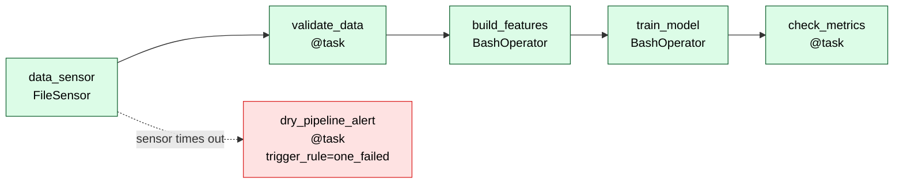
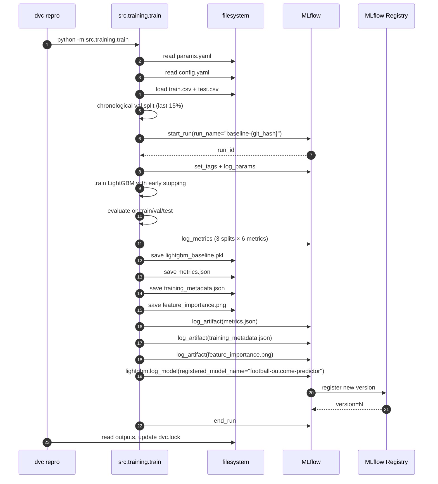
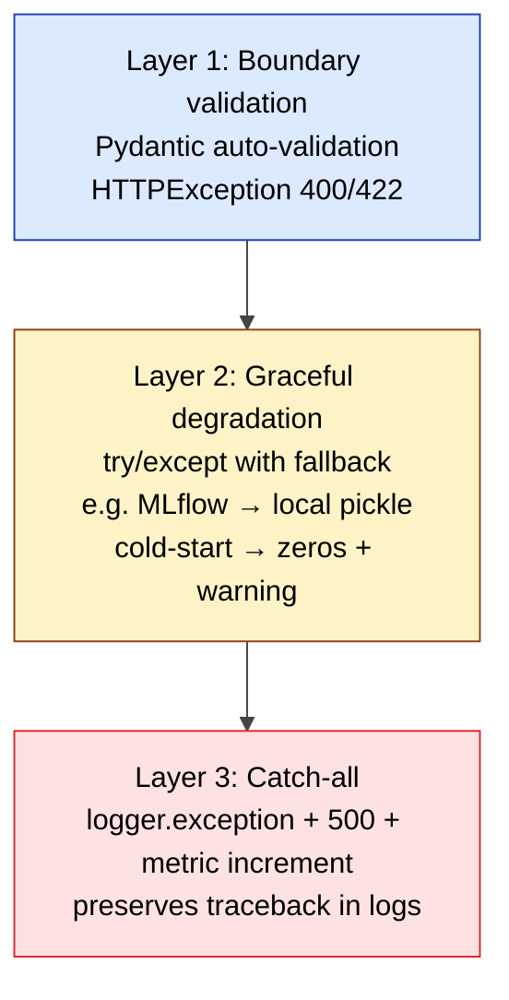

# Low-Level Design — Football MLOps End-to-End Project

**Document version:** 1.0
**Last updated:** 2026-04-28 (Day 6)
**Project:** DA5402 Final Project — Football Match Outcome Prediction
**Author:** Muhammed Fiyas
**Companion documents:** [HLD](../hld/HLD.md) · [Test Plan](../test_plan/TEST_PLAN.md) · [API Reference](api_endpoints.md)

---

## 1. Purpose

This document describes the **internal structure** of the codebase: module layout, public interfaces, key data structures, internal call paths, and coding conventions. It complements the [HLD](../hld/HLD.md), which covers the system at the container/service level.

The intended reader is someone who has read the HLD and now wants to make a code-level change — adding a feature, fixing a bug, or porting to a different platform.

---

## 2. Repository Layout

The project follows a standard Python package layout with declarative configuration at the root and orchestration files in dedicated folders.

```
mlops_end_to_end_project/
├── config.yaml              # paths + logging config (single source of truth for paths)
├── params.yaml              # ML hyperparameters + feature/split params (DVC-tracked)
├── environment.yml          # conda env definition
├── requirements.txt         # pip pin for Docker layers
├── dvc.yaml                 # DVC pipeline DAG (build_features → train)
├── dvc.lock                 # DVC pipeline state (content hashes)
├── docker-compose.yml       # 11-container stack definition
├── MLproject                # MLflow entry point declaration
│
├── src/                     # all Python source code
│   ├── api/
│   │   ├── main.py                  # FastAPI app + endpoints + lifespan
│   │   └── feature_service.py       # runtime feature builder for /predict
│   ├── features/
│   │   └── build_features.py        # batch feature engineering (DVC stage)
│   ├── training/
│   │   └── train.py                 # LightGBM training + MLflow logging (DVC stage)
│   └── utils/
│       └── logger.py                # rotating-file logger factory
│
├── data/                    # DVC-tracked
│   ├── raw/database.sqlite          # Kaggle source (300 MB)
│   ├── processed/                   # train.csv, test.csv, team_lookup.csv
│   ├── production/                  # season_2015_16.csv (drift simulation)
│   └── triggers/                    # FileSensor target dir
│
├── models/                  # DVC-tracked
│   ├── lightgbm_baseline.pkl        # current best model (also in MLflow registry)
│   ├── metrics.json                 # train/val/test F1, ROC-AUC, accuracy
│   ├── training_metadata.json       # git_hash, params, dates
│   └── feature_importance.png       # plot
│
├── frontend/                # not Python — vanilla static UI
│   ├── templates/index.html
│   └── static/{app.js, style.css}
│
├── docker/                  # Dockerfiles
│   ├── Dockerfile.backend
│   ├── Dockerfile.frontend
│   ├── Dockerfile.airflow
│   └── nginx.conf
│
├── airflow/
│   ├── dags/football_training_dag.py
│   └── config/simple_auth_manager_passwords.json.generated
│
├── monitoring/              # observability stack configs
│   ├── prometheus/
│   │   ├── prometheus.yml
│   │   └── rules/football_alerts.yml
│   ├── alertmanager/alertmanager.yml
│   └── grafana/
│       ├── provisioning/{datasources,dashboards}/*.yml
│       └── dashboards/football-overview.json
│
├── webhook_logger/          # alert receiver stub
│   ├── app.py
│   └── Dockerfile
│
├── tests/                   # pytest suite (14 cases)
│   ├── conftest.py
│   ├── test_api_smoke.py
│   ├── test_api_validation.py
│   ├── test_feature_service.py
│   └── test_build_features.py
│
└── docs/                    # all design documentation
    ├── hld/HLD.md
    ├── lld/{LLD.md, api_endpoints.md}
    ├── test_plan/TEST_PLAN.md
    ├── user_manual/USER_MANUAL.md
    └── daily_log/day_NN.md
```

### 2.1 Why this structure

- **`src/` separates code from configs** — everything Python lives under one tree, importable as `src.api.main`, `src.features.build_features`, etc.
- **DVC-tracked dirs (`data/`, `models/`) are at the top level** — not under `src/`, because they're outputs and not source code
- **`monitoring/`, `airflow/`, `docker/`, `webhook_logger/` are siblings** — they're infrastructure config or auxiliary services, not part of the application
- **`docs/` is browsable on GitHub** — every document is a markdown file with diagrams that render natively

---

## 3. API Specification

### 3.1 Endpoint summary

The backend exposes four endpoints. Full request/response specs are in [`api_endpoints.md`](api_endpoints.md); the live spec is auto-generated by FastAPI at `http://localhost:8000/docs` (Swagger UI).

| Method | Path | Purpose | Response model |
|---|---|---|---|
| GET | `/health` | Liveness check + container ID | `HealthResponse` |
| GET | `/teams` | List all 299 teams (for frontend dropdown) | `TeamsResponse` |
| POST | `/predict` | Predict match outcome (H/D/A) + probabilities | `PredictResponse` |
| GET | `/metrics` | Prometheus metrics (text/plain exposition format) | text |

### 3.2 Pydantic request/response models

All API models live in `src/api/main.py`:

```python
class HealthResponse(BaseModel):
    status: str                          # "ok" or "degraded"
    model_loaded: bool
    container_id: str                    # docker hostname
    timestamp: str                       # ISO-8601 UTC

class TeamInfo(BaseModel):
    team_api_id: int
    name: str
    short_name: Optional[str] = None

class PredictRequest(BaseModel):
    home_team_id: int = Field(..., description="team_api_id of home team")
    away_team_id: int = Field(..., description="team_api_id of away team")
    match_date: Optional[date] = Field(None, description="YYYY-MM-DD; defaults to today")

class PredictResponse(BaseModel):
    prediction: str                      # "H" | "D" | "A"
    prediction_label: str                # "Home Win" | "Draw" | "Away Win"
    confidence: float                    # max prob, 0..1
    probabilities: dict[str, float]      # {"H": .., "D": .., "A": ..}
    home_team: str
    away_team: str
    match_date: str
    container_id: str
    model_version: str                   # e.g. "mlflow:football-outcome-predictor@latest"
    inference_latency_ms: int
```

### 3.3 Status codes contract

| Code | When | Origin |
|---|---|---|
| 200 | Successful prediction or healthcheck | application |
| 400 | Unknown team_id, identical home/away IDs | business validation in `/predict` |
| 422 | Malformed JSON body, missing/wrong-typed fields | Pydantic auto-validation |
| 500 | Unhandled exception inside `/predict` (caught by outermost try/except) | application |
| 503 | Service not yet ready (model still loading) | application |

The 400/422 distinction is deliberate: Pydantic catches *shape* errors before user code runs (422); business validation catches *semantic* errors after Pydantic accepts the shape (400). This separation makes failure causes diagnosable.

---

## 4. Module-Level Design

This section documents each significant module: its purpose, public interface, key invariants, and important implementation notes.

### 4.1 `src/api/main.py` — FastAPI application

**Purpose:** ASGI entry point. Creates the FastAPI app, registers endpoints, manages model lifecycle via lifespan handler.

**Key globals (initialized at import time):**

```python
PROJECT_ROOT: Path        # walked up from __file__ to find config.yaml
CONFIG: dict              # parsed config.yaml
MODEL_PATH: Path          # local pickle fallback
DB_PATH: Path             # SQLite for runtime feature lookup
TEAM_LOOKUP_PATH: Path    # CSV for team name resolution
CONTAINER_ID: str         # socket.gethostname() — A2 pattern
INT_TO_OUTCOME: dict      # {0:'H', 1:'D', 2:'A'}
```

**Application state (populated in `lifespan`):**

```python
class AppState:
    model: Optional[lightgbm.LGBMClassifier] = None
    feature_service: Optional[FeatureService] = None
    model_version: str = "unknown"

state = AppState()  # module-level singleton
```

**Prometheus metrics defined here** (5 instruments):

```python
PREDICTIONS_TOTAL          # Counter, labeled by predicted_class
PREDICTION_ERRORS_TOTAL    # Counter, labeled by status_code
PREDICTION_LATENCY_SECONDS # Histogram, 10 buckets 5ms..5s
MODEL_INFO                 # Gauge, info-pattern with version+source labels
MODEL_LOAD_TOTAL           # Counter, labeled by source (mlflow|local)
```

**Lifespan handler** (`@asynccontextmanager async def lifespan`):

1. Read `MLFLOW_TRACKING_URI` env var
2. Try `mlflow.lightgbm.load_model("models:/football-outcome-predictor/latest")`
3. On failure → log warning, fall back to `joblib.load(MODEL_PATH)`
4. Construct `FeatureService(db_path, team_lookup_path)`
5. Increment `MODEL_LOAD_TOTAL{source=...}` and `MODEL_INFO{version,source}`

**Invariants:**

- `state.model is not None` after lifespan startup completes (or app raises)
- `state.feature_service is not None` after lifespan startup completes
- `state.model_version` is always a non-empty string

### 4.2 `src/api/feature_service.py` — runtime feature builder

**Purpose:** Live feature computation for `/predict`. Mirrors the batch logic in `build_features.py` but operates on a single (home, away, date) tuple instead of a full DataFrame.

**Public interface:**

```python
class FeatureService:
    def __init__(self, db_path: Path, team_lookup_path: Path) -> None: ...

    def team_exists(self, team_api_id: int) -> bool: ...
    def get_team_name(self, team_api_id: int) -> Optional[str]: ...
    def list_teams(self) -> list[dict]: ...
    def build_features(
        self,
        home_team_id: int,
        away_team_id: int,
        match_date: datetime,
    ) -> pd.DataFrame: ...
```

**Internal helpers** (single-leading-underscore convention for private):

```python
_compute_fifa_means(self) -> dict      # column means computed once at __init__
_compute_team_form(team_id, date) -> dict
_compute_head_to_head(home_id, away_id, date) -> dict
_get_fifa_snapshot(team_id, date) -> dict
_expected_columns(self) -> list[str]   # contract test target — must match train.FEATURE_COLUMNS
```

**Key invariants:**

- The list returned by `_expected_columns()` is in the exact order the model expects
- This list **must equal** `src.training.train.FEATURE_COLUMNS` — enforced by test `TC-6.1`
- Cold-start cases (insufficient match history, missing FIFA snapshot) return defaults with a warning, never raise

**Data structures:**

```python
self.conn: sqlite3.Connection      # opened with check_same_thread=False
self.team_lookup: pd.DataFrame     # loaded once from CSV
self._fifa_means: dict[str, float] # computed once in __init__
```

**Error handling:**

- `__init__` raises `FileNotFoundError` if `db_path` or `team_lookup_path` doesn't exist (Day 5 fix)
- `team_exists()` returns `bool`, never raises
- `build_features()` raises only if internal SQLite query fails (caught by `/predict`'s outer try/except)

### 4.3 `src/features/build_features.py` — batch feature engineering (DVC stage)

**Purpose:** Process the entire SQLite database into train/test/production CSVs. Runs as a DVC stage; called by Airflow's `build_features` task.

**Pipeline functions** (called in order from `main()`):

```python
load_raw_data(db_path: Path) -> tuple[matches, teams, team_attrs]
derive_target(matches: DataFrame) -> DataFrame
compute_rolling_form(matches, window=5) -> DataFrame
compute_head_to_head(matches, window=5) -> DataFrame
attach_fifa_features(matches, team_attrs) -> DataFrame
chronological_split(matches, train_seasons, test_seasons, prod_seasons) -> tuple[train, test, prod]
```

**Constants:**

```python
OUTCOME_TO_INT = {'H': 0, 'D': 1, 'A': 2}
FIFA_NUMERIC_COLS = [9 columns from Team_Attributes table]
```

**CLI override pattern:**

```python
python -m src.features.build_features \
    --rolling-window 10 \
    --h2h-window 8
```

CLI args override `params.yaml` values for experimentation without editing files.

**Invariants enforced by raise:**

- `derive_target()` raises `ValueError` if any null outcomes appear
- `chronological_split()` raises `ValueError` if any season is unknown
- `chronological_split()` raises `ValueError` if any season appears in multiple splits (leakage check)
- `load_raw_data()` raises `FileNotFoundError` if SQLite missing (Day 5 fix)

**Outputs written to disk:**

```
data/processed/train.csv           # 18,429 rows × 44 cols
data/processed/test.csv            # 3,270 rows × 44 cols
data/processed/team_lookup.csv     # 299 teams (for frontend dropdown)
data/production/season_2015_16.csv # 3,262 rows for drift sim
```

### 4.4 `src/training/train.py` — model training (DVC stage)

**Purpose:** Load processed CSVs, train regularized LightGBM with early stopping, evaluate on three splits, persist artifacts to disk AND to MLflow.

**Pipeline functions:**

```python
load_train_test(processed_dir) -> tuple[X_train, y_train, X_test, y_test]
chronological_train_val_split(X, y, val_fraction) -> tuple[X_fit, y_fit, X_val, y_val]
train_model(X_fit, y_fit, X_val, y_val, model_params, early_stopping_rounds) -> LGBMClassifier
evaluate(model, X, y, split_name) -> dict[metric_name, value]
save_artifacts(model, metrics, model_params, ..., models_dir) -> None
```

**Public constant — must stay in lockstep with `FeatureService._expected_columns()`:**

```python
FEATURE_COLUMNS: list[str]  # 32 columns: 10 form + 4 H2H + 18 FIFA
TARGET_COLUMN = 'outcome_encoded'
TARGET_NAMES = ['H', 'D', 'A']
```

**MLflow integration** (within `mlflow.start_run()` context):

```python
mlflow.set_tags({git_commit, stage, framework, dataset})
mlflow.log_params(model_params + training params + feature params)
mlflow.log_metrics({split_name}_macro_f1, {split_name}_roc_auc, ...)
mlflow.log_artifact(metrics.json)
mlflow.log_artifact(training_metadata.json)
mlflow.log_artifact(feature_importance.png)
mlflow.lightgbm.log_model(
    lgb_model=model,
    name="model",
    registered_model_name="football-outcome-predictor",
    input_example=X_test.head(3),
)
```

The `registered_model_name` argument is what triggers automatic registration — every successful run produces a new version of the named model in MLflow's registry.

### 4.5 `src/utils/logger.py` — rotating logger factory

**Purpose:** Single, consistent logger across all modules. YAML-driven configuration, rotating file handler, console output.

**Public interface:**

```python
def get_logger(name: str) -> logging.Logger:
    """Return a configured logger. Cached per module name."""
```

**Usage pattern in every module:**

```python
from src.utils.logger import get_logger
logger = get_logger(__name__)
```

**Log file:** `logs/football_mlops.log`
**Rotation:** 10 MB per file × 5 backups (default; configurable via `config.yaml`)
**Format:** `{timestamp} | {level:8s} | {name} | {message}`

**Invariant:** repeated `get_logger(__name__)` calls within the same process return the same `Logger` object — no handler duplication.

### 4.6 `airflow/dags/football_training_dag.py` — orchestration DAG

**Purpose:** Schedule weekly retraining; demonstrate sensors, pools, retries, quality gates.

**DAG-level configuration:**

```python
dag_id = "football_training_pipeline"
schedule = "0 2 * * 0"         # Sunday 02:00 UTC
catchup = False
max_active_runs = 1
default_args = {
    "retries": 2,
    "retry_delay": timedelta(minutes=1),
    "retry_exponential_backoff": True,
    "max_retry_delay": timedelta(minutes=10),
}
```

**Task graph:**



**Task-level details:**

| Task | Type | Pool | Notes |
|---|---|---|---|
| `data_sensor` | `FileSensor` | default | watches `data/triggers/retrain_trigger.txt`; mode=`reschedule`; poke=30s; timeout=5min |
| `validate_data` | `@task` | default | checks trigger freshness <24h + raw DB size >1MB |
| `build_features` | `BashOperator` | `training_pool` (1 slot) | runs `dvc repro build_features` |
| `train_model` | `BashOperator` | `training_pool` (1 slot) | runs `dvc repro train` |
| `check_metrics` | `@task` | default | reads `models/metrics.json`, raises if F1 < 0.40 |
| `dry_pipeline_alert` | `@task` | default | `trigger_rule="one_failed"`; logs warning when sensor times out |

**Why `training_pool`** with 1 slot: `build_features` and `train_model` both tagged → can never run in parallel → prevents memory contention on a single host.

### 4.7 `webhook_logger/app.py` — alert receiver stub

**Purpose:** Receive AlertManager webhook payloads, pretty-print to stdout. Stand-in for production receivers (Slack, PagerDuty, SendGrid).

**Two endpoints:**

```python
POST /alerts     # default route — receives all severities
POST /critical   # critical-only route — receives severity=critical
GET  /health     # liveness check
```

**Each endpoint reads JSON body, extracts the AlertManager envelope:**

```python
{
    "receiver": str,
    "status": "firing" | "resolved",
    "alerts": [
        {
            "labels": {"alertname": str, "severity": str, ...},
            "annotations": {"summary": str, "description": str},
            "startsAt": ISO-8601,
            ...
        },
        ...
    ]
}
```

Logs are flushed line-by-line so `docker compose logs webhook-logger` shows alerts in real time.

---

## 5. Data Schemas

### 5.1 Source SQLite tables (read-only)

The Kaggle European Soccer Database has multiple tables; the project uses three:

**`Match`** (~25,000 rows):

```sql
id INTEGER PRIMARY KEY,
country_id INTEGER,
league_id INTEGER,
season TEXT,                   -- "2008/2009" .. "2015/2016"
stage INTEGER,
date TEXT,                     -- "2008-08-09 00:00:00"
home_team_api_id INTEGER,      -- joins Team
away_team_api_id INTEGER,      -- joins Team
home_team_goal INTEGER,
away_team_goal INTEGER,
-- (40+ columns we don't use: lineups, betting odds, ...)
```

**`Team`** (~300 rows):

```sql
team_api_id INTEGER,           -- stable ID used as foreign key
team_fifa_api_id INTEGER,
team_long_name TEXT,
team_short_name TEXT
```

**`Team_Attributes`** (~1,500 snapshot rows):

```sql
team_api_id INTEGER,
date TEXT,                     -- snapshot date
buildUpPlaySpeed INTEGER,
buildUpPlayDribbling INTEGER,
buildUpPlayPassing INTEGER,
chanceCreationPassing INTEGER,
chanceCreationCrossing INTEGER,
chanceCreationShooting INTEGER,
defencePressure INTEGER,
defenceAggression INTEGER,
defenceTeamWidth INTEGER,
-- (categorical FIFA columns we don't use: buildUpPlayPositioningClass, ...)
```

### 5.2 Processed CSV schemas

After feature engineering, `train.csv` and `test.csv` have these columns:

**Identification columns** (kept for traceability, not used as features):

```
id, country_id, league_id, season, stage, date,
home_team_api_id, away_team_api_id, home_team_goal, away_team_goal,
outcome, outcome_encoded
```

**Feature columns (32, in order)** — this list is enforced by `TC-6.1`:

```
home_form_wins, home_form_draws, home_form_losses,
home_form_gs_avg, home_form_gc_avg,
away_form_wins, away_form_draws, away_form_losses,
away_form_gs_avg, away_form_gc_avg,
h2h_home_wins, h2h_draws, h2h_away_wins, h2h_n_meetings,
home_buildUpPlaySpeed, home_buildUpPlayDribbling, home_buildUpPlayPassing,
home_chanceCreationPassing, home_chanceCreationCrossing, home_chanceCreationShooting,
home_defencePressure, home_defenceAggression, home_defenceTeamWidth,
away_buildUpPlaySpeed, away_buildUpPlayDribbling, away_buildUpPlayPassing,
away_chanceCreationPassing, away_chanceCreationCrossing, away_chanceCreationShooting,
away_defencePressure, away_defenceAggression, away_defenceTeamWidth,
```

### 5.3 `team_lookup.csv` (frontend dropdown source)

```
team_api_id,team_long_name,team_short_name
9987,Real Madrid CF,REA
8634,FC Barcelona,BAR
...
```

---

## 6. Configuration

### 6.1 `config.yaml` — paths and logging

```yaml
data:
  raw_db: "data/raw/database.sqlite"
  processed_dir: "data/processed"
  production_dir: "data/production"

logging:
  log_dir: "logs"
  log_file: "football_mlops.log"
  level: "INFO"
  rotation:
    max_bytes: 10485760     # 10 MB
    backup_count: 5
```

`config.yaml` answers: *"Where do things live?"* — paths only. No hyperparameters here.

### 6.2 `params.yaml` — DVC-tracked hyperparameters

```yaml
features:
  rolling_window_size: 5      # last N matches for form features
  h2h_window_size: 5          # last N meetings for H2H features

split:
  train_seasons: ["2008/2009", "2009/2010", ..., "2013/2014"]
  test_seasons:  ["2014/2015"]
  production_seasons: ["2015/2016"]

training:
  val_fraction: 0.15
  early_stopping_rounds: 50

model:
  algorithm: lightgbm
  num_leaves: 15              # regularized
  learning_rate: 0.05
  n_estimators: 1000
  min_child_samples: 20
  reg_alpha: 0.1
  reg_lambda: 0.1
  subsample: 0.8
  colsample_bytree: 0.8
  class_weight: balanced
  random_state: 42
```

`params.yaml` answers: *"What numbers control behavior?"* — hyperparameters and structural choices. Tracked by DVC; changing any value triggers `dvc repro` of the affected stages.

---

## 7. Internal Sequence: Training Pipeline

This sequence shows what happens when `dvc repro train` runs (either manually or from Airflow's `train_model` task):



The same artifacts are written **twice**: once to `models/` on disk (consumed by DVC), once to MLflow's artifact store (consumed by the backend at startup). This dual-persistence is intentional — DVC tracks reproducibility, MLflow tracks experimentation.

---

## 8. Error Handling Architecture

### 8.1 Three layers

The codebase uses Python's built-in exceptions (no custom hierarchy). Error handling is organized in three layers:



### 8.2 Exception types used

| Exception | Where raised | Purpose |
|---|---|---|
| `FileNotFoundError` | `FeatureService.__init__`, `load_raw_data` | Missing input data; remediation hint included |
| `ValueError` | `derive_target`, `chronological_split` | Invalid input shape; specifically, leakage prevention |
| `RuntimeError` | model loader fallback path | When even the local pickle is missing |
| `HTTPException(400)` | `/predict` business validation | Bad team_id or duplicate teams |
| `HTTPException(422)` | FastAPI auto | Malformed JSON body (no user code involved) |
| `HTTPException(500)` | `/predict` outer except | Unhandled internal failure |

### 8.3 Why no custom exception hierarchy

At this codebase scope (~1,500 lines of Python), a custom hierarchy adds maintenance burden without proportional benefit. The HTTP boundary already provides the taxonomy callers need (status codes). If the codebase grew to multi-module domain logic, the right addition would be a `FeatureBuildError`, `ModelLoadError`, etc., so that the `/predict` handler could distinguish between recoverable failures (cold start) and non-recoverable ones (model corrupt).

### 8.4 No `tenacity` or `backoff` libraries

For external retries inside the request path: not needed — `/predict` doesn't call out to any flaky external service. Pipeline-level retries are handled declaratively by Airflow's `retries=2 + retry_exponential_backoff` in `default_args`. Adding `tenacity` would duplicate Airflow's responsibility.

---

## 9. Observability Hooks in Code

Application code touches the metrics layer in three places only:

### 9.1 At startup (in `lifespan`)

```python
MODEL_LOAD_TOTAL.labels(source="mlflow").inc()
MODEL_INFO.labels(version=state.model_version, source="mlflow").set(1)
```

### 9.2 In `/predict` happy path

```python
PREDICTION_LATENCY_SECONDS.observe(latency_seconds)
PREDICTIONS_TOTAL.labels(predicted_class=predicted_outcome).inc()
```

### 9.3 In `/predict` error paths

```python
PREDICTION_ERRORS_TOTAL.labels(status_code="400").inc()  # business validation
PREDICTION_ERRORS_TOTAL.labels(status_code="500").inc()  # internal failure
```

The `/metrics` endpoint itself does no work — it just calls `prometheus_client.generate_latest()`, which serializes the current state of all registered collectors.

**Design principle:** instrumentation should be a one-line side-effect, never logic that can fail. If `PREDICTIONS_TOTAL.labels(...).inc()` itself raised, our error handling would have an infinite loop. `prometheus_client` is documented as exception-safe under all observed conditions.

---

## 10. Coding Conventions

### 10.1 Style

- **PEP 8**, enforced informally (no linter in CI for this academic project)
- 4-space indent, ~100-char soft line limit
- Type hints on all public function signatures (informal where they'd be noisy)

### 10.2 Naming

- `module_name`: lowercase + underscores
- `ClassName`: PascalCase
- `function_name`, `variable_name`: lowercase + underscores
- `_private_method`: single leading underscore for module-internal helpers
- `CONSTANT_NAME`: uppercase + underscores (module-level constants)

### 10.3 Imports

Three groups, separated by blank lines:

```python
# 1. standard library
import os
from pathlib import Path

# 2. third-party
import pandas as pd
import yaml

# 3. project
from src.utils.logger import get_logger
```

### 10.4 Logging

Every module starts with:

```python
from src.utils.logger import get_logger
logger = get_logger(__name__)
```

Never `print()`. The `__name__` argument propagates module hierarchy into log lines.

### 10.5 Docstrings

Functions exposed across modules have triple-quoted docstrings. Internal helpers have short single-line comments. We don't enforce a specific docstring format (Google vs NumPy style); consistency within a file matters more than format choice.

---

## 11. Build & Run

This is a code-level reference; the [User Manual](../user_manual/USER_MANUAL.md) has the operational walkthrough.

### 11.1 Local development (no Docker)

```bash
conda env create -f environment.yml
conda activate football-mlops

# Run the feature engineering DVC stage
python -m src.features.build_features

# Run training
python -m src.training.train

# Start the API (requires MLflow server running locally on :5000)
mlflow server --backend-store-uri sqlite:///mlflow.db --default-artifact-root ./mlflow_artifacts &
uvicorn src.api.main:app --reload --port 8000
```

### 11.2 Containerized (recommended)

```bash
docker compose up -d        # brings up all 11 services
docker compose ps           # verify all healthy

# Tear down
docker compose down         # stops + removes containers; volumes persist
docker compose down -v      # also removes volumes (full reset)
```

### 11.3 Tests

```bash
pip install pytest httpx
pytest tests/ -v            # 14 cases, ~3 seconds
```

---

## 12. Extension Points

How to extend the system, organized by what you'd want to change.

### 12.1 Add a new feature column

1. Add the SQL/computation to `_compute_team_form` (or analogous helper) in `feature_service.py`
2. Add the same logic to the corresponding `compute_*` function in `build_features.py`
3. Add the new column name to **both** `train.FEATURE_COLUMNS` **and** `FeatureService._expected_columns()` — in the same order
4. Run the contract test: `pytest tests/test_feature_service.py::test_feature_columns_match_train_contract`
5. Re-run the DVC pipeline: `dvc repro --force`
6. Verify in MLflow that the new run logs the new feature in feature_importance.png

### 12.2 Try a different ML algorithm

1. In `train.py`, replace the `lgb.LGBMClassifier(...)` instantiation in `train_model()` with the new algorithm
2. Update the `framework` tag in `mlflow.set_tags(...)` accordingly
3. Replace `mlflow.lightgbm.log_model` with the right flavor (`mlflow.sklearn.log_model`, `mlflow.pytorch.log_model`, etc.)
4. Run the pipeline: `dvc repro --force train`
5. Compare in MLflow UI side-by-side with the LightGBM baseline

### 12.3 Add a new alert

1. Add a rule block to `monitoring/prometheus/rules/football_alerts.yml`
2. Hot-reload Prometheus: `curl -X POST http://localhost:9090/-/reload`
3. (Optional) add a route in `monitoring/alertmanager/alertmanager.yml` if it should hit a different receiver
4. Trigger the condition manually to verify it fires

### 12.4 Add a new dashboard panel

1. Edit `monitoring/grafana/dashboards/football-overview.json` (or create a new dashboard JSON in the same folder)
2. Wait 30 s; Grafana's file provider auto-reloads
3. Verify in the UI

### 12.5 Add a new test

1. Create a `test_*.py` file under `tests/`
2. Use the shared fixtures from `conftest.py` (`http_client`, `real_team_ids`, etc.)
3. Run `pytest tests/<your_file>::<your_test> -v` to iterate

---

## 13. Document History

| Version | Date | Author | Notes |
|---|---|---|---|
| 1.0 | 2026-04-28 | Muhammed Fiyas | Initial LLD covering the v0.5.0 milestone |